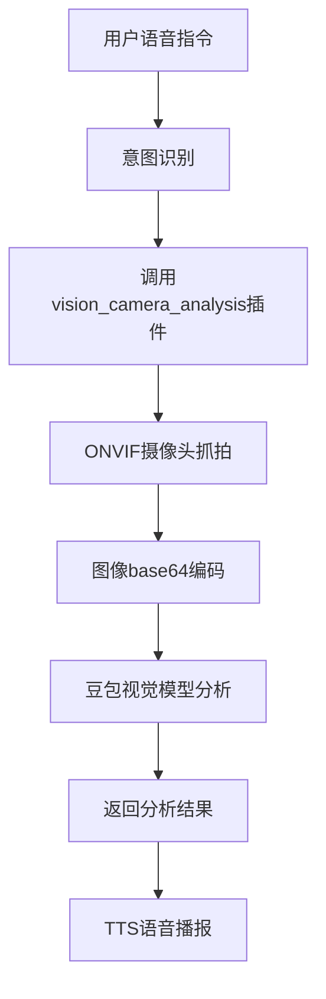

# 📹🔍 视觉摄像头分析插件使用指南

## 🎯 功能概述

视觉摄像头分析插件结合了ONVIF摄像头控制和豆包视觉大模型，实现语音控制摄像头抓拍并进行AI视觉分析的功能。

### ✨ 主要特性
- 🎛️ **语音控制**：通过自然语言指令控制摄像头抓拍
- 📸 **智能抓拍**：自动抓拍并获取最新图像
- 🤖 **AI分析**：使用豆包视觉大模型进行图像分析
- 👥 **人数统计**：准确识别画面中的人数
- 🔍 **物体识别**：识别画面中的各种物体和场景
- 🛡️ **安全检查**：检测异常情况和安全隐患

## 🔧 配置步骤

### 1. 配置豆包视觉模型

在 `main/xiaozhi-server/data/.config.yaml` 文件中已添加豆包视觉模型配置：

```yaml
# 选择使用的模块配置
selected_module:
  # 视觉语言大模型，使用豆包视觉模型
  VLLM: DoubaoVLLM
  # 意图识别使用function_call模式，支持工具调用
  Intent: function_call

# VLLM配置（视觉语言大模型）
VLLM:
  DoubaoVLLM:
    type: openai
    # 豆包视觉大模型，火山引擎提供的视觉理解服务
    # 开通地址：https://console.volcengine.com/ark/region:ark+cn-beijing/openManagement
    # 搜索并开通 doubao-vision-pro-32k 模型
    # 获取密钥：https://console.volcengine.com/ark/region:ark+cn-beijing/apiKey
    base_url: https://ark.cn-beijing.volces.com/api/v3
    model_name: doubao-vision-pro-32k
    api_key: 你的doubao_vision_api_key  # 请替换为你的真实API密钥
```

### 2. 申请豆包视觉模型API密钥

1. **开通服务**：
   - 访问 [火山引擎控制台](https://console.volcengine.com/ark/region:ark+cn-beijing/openManagement)
   - 搜索并开通 `doubao-vision-pro-32k` 模型
   - 确认开通成功

2. **获取API密钥**：
   - 进入 [API密钥管理页面](https://console.volcengine.com/ark/region:ark+cn-beijing/apiKey)
   - 创建新的API密钥
   - 复制密钥并替换配置文件中的 `你的doubao_vision_api_key`

### 3. 确认摄像头配置

确保 ONVIF 摄像头已正确配置（`.config.yaml` 中已有配置示例）：

```yaml
plugins:
  # ONVIF摄像头控制插件配置
  onvif_camera:
    cameras:
      bedroom_camera:
        alias: "卧室摄像头"
        ip: "192.168.1.105"      # 请修改为您的摄像头IP地址
        port: 80
        username: "admin"
        password: "your_password"  # 请修改为您的摄像头密码
```

### 4. 插件功能配置

插件配置已在 `.config.yaml` 中完成：

```yaml
plugins:
  # 视觉摄像头分析插件配置
  vision_camera_analysis:
    # 支持的摄像头列表
    supported_cameras:
      - "卧室摄像头"
    
    # 视觉分析配置
    analysis_settings:
      capture_delay: 2          # 抓拍后等待时间（秒）
      analysis_timeout: 30      # 分析超时时间（秒）
      keep_analyzed_images: true # 是否保留分析后的图片
      detail_level: "detailed"   # 分析详细程度
    
    # 预设分析问题模板
    question_templates:
      人数统计: "请仔细观察这张图片，统计画面中有多少个人，并描述他们的大致位置"
      物体识别: "请识别并描述图片中的主要物体和场景"
      安全检查: "请检查画面中是否有异常情况，比如陌生人、物品遗失等"
      场景分析: "请详细描述这个场景的整体情况"
```

## 🎤 语音指令示例

### 人数统计
- **基础指令**：
  - "帮我看下卧室现在有几个人"
  - "检查一下卧室有多少人"
  - "卧室摄像头看看现在有几个人"

### 场景分析
- **物体识别**：
  - "看看卧室里有什么东西"
  - "分析一下卧室的情况"
  - "检查卧室摄像头的画面"

### 安全检查
- **异常检测**：
  - "检查卧室有没有异常"
  - "看看房间是否安全"
  - "有没有陌生人在卧室"

### 自定义分析
- **自由提问**：
  - "卧室的灯开着吗"
  - "窗户是开着还是关着的"
  - "床上有人吗"

## 📊 功能流程



## 🔍 分析类型说明

### 1. 人数统计 (analysis_type: "人数统计")
- **功能**：准确统计画面中的人数
- **适用场景**：家庭监控、会议室人数统计
- **示例结果**："画面中有2个人，一个坐在床边，一个站在窗户旁"

### 2. 物体识别 (analysis_type: "物体识别")
- **功能**：识别画面中的各种物体
- **适用场景**：房间物品清点、场景理解
- **示例结果**："房间内有床、桌子、椅子、台灯和一些书籍"

### 3. 安全检查 (analysis_type: "安全检查")
- **功能**：检测潜在的安全隐患
- **适用场景**：安防监控、异常检测
- **示例结果**："画面正常，没有发现异常情况或陌生人"

### 4. 场景分析 (analysis_type: "场景分析")
- **功能**：综合分析整个场景
- **适用场景**：全面了解环境状况
- **示例结果**："这是一个卧室场景，光线充足，房间整洁，有一个人在休息"

## 🛠️ 故障排除

### 常见问题

1. **"未配置默认的视觉分析模块"错误**
   ```
   解决方案：确认.config.yaml中selected_module.VLLM配置为DoubaoVLLM
   ```

2. **"豆包API密钥无效"错误**
   ```
   解决方案：
   - 检查API密钥是否正确
   - 确认已开通doubao-vision-pro-32k模型
   - 检查API密钥是否有足够额度
   ```

3. **"摄像头抓拍失败"错误**
   ```
   解决方案：
   - 确认ONVIF摄像头配置正确
   - 检查网络连接
   - 验证摄像头用户名密码
   ```

4. **"摄像头不在支持列表中"错误**
   ```
   解决方案：
   - 检查vision_camera_analysis.supported_cameras配置
   - 确认摄像头别名与onvif_camera配置一致
   ```

### 调试技巧

1. **查看详细日志**：
   ```yaml
   log:
     log_level: DEBUG  # 在.config.yaml中设置
   ```

2. **测试ONVIF摄像头**：
   ```
   语音指令："抓拍一张卧室的照片"
   确认摄像头抓拍功能正常
   ```

3. **验证豆包API**：
   ```
   检查火山引擎控制台的API调用记录
   确认模型调用是否成功
   ```

## 📈 性能优化建议

### 1. 图像质量优化
- **摄像头设置**：使用1080P或更高分辨率
- **光线条件**：确保充足的光线环境
- **稳定性**：避免摄像头震动

### 2. 分析效率优化
- **问题精确性**：使用具体明确的分析问题
- **模板使用**：利用预设的问题模板提高准确性
- **超时设置**：根据网络环境调整analysis_timeout

### 3. 存储管理
- **图片清理**：定期清理captures目录
- **保留策略**：根据需要调整keep_analyzed_images设置
- **存储监控**：监控磁盘空间使用情况

## 💡 使用技巧

### 1. 问题表达技巧
- **具体明确**：说明要分析的具体内容
- **上下文**：提供必要的背景信息
- **分步询问**：复杂分析可以分步进行

### 2. 摄像头管理
- **命名规范**：使用清晰的摄像头别名
- **位置优化**：调整摄像头角度获得最佳视野
- **定期检查**：确保摄像头工作正常

### 3. 结果理解
- **结合上下文**：结合实际情况理解分析结果
- **多次确认**：重要情况可以多次分析确认
- **人工验证**：关键决策应结合人工判断

## 🆘 获取支持

如果遇到问题，可以：

1. 查看系统日志获取详细错误信息
2. 检查火山引擎控制台的API调用状态
3. 验证ONVIF摄像头配置和网络连接
4. 在项目Issues中提交问题报告

---

**提示**：首次使用时建议先测试摄像头抓拍功能，确认正常后再进行视觉分析功能的测试。 